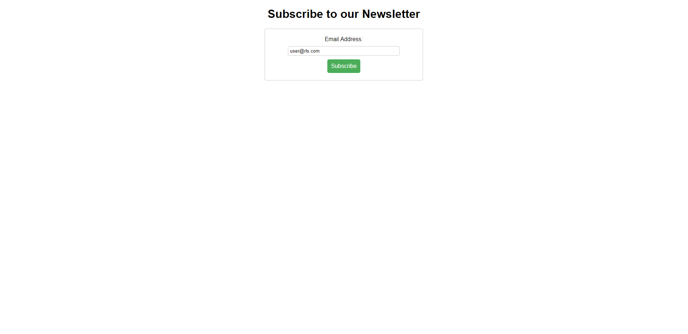
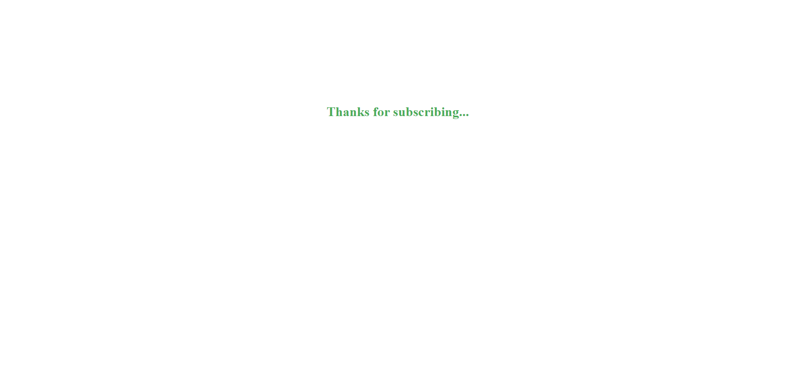
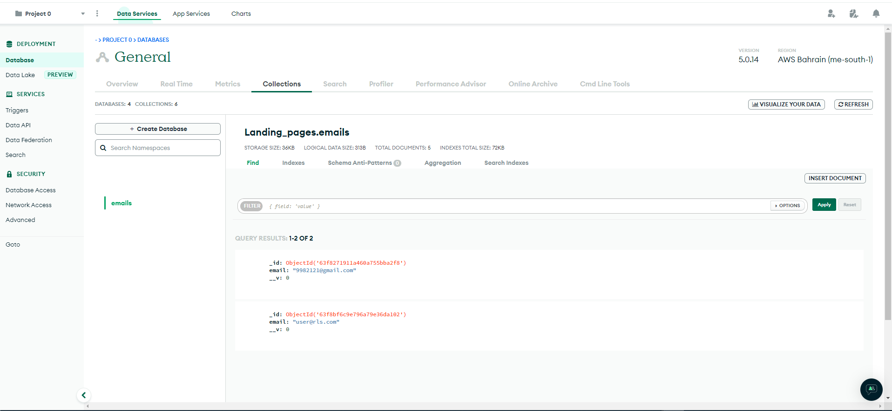

# Landing-page-skeleton

This is a preliminary sketch To create a landing page with the option to sign up for Newsletters.

The users' emails will be written directly to MongoDB

### This is the registration page ↓



### Here the user will be directed to an HTML page after entering an email and clicking the button ↓



### Here you can see the emails written to the databases before encryption



## Configuration process

In order to run this repo locally, add a dev.js file to ./config With the following variables: `CONNECT_PASS`

```javascript
module.exports = {
  CONNECT_PASS: "<your mongoDB password>",
};
```

In order to run this repo on a server you must add the variables `CONNECT_PASS` to Config Vars.

To install node_modules and all dependecies run `npm install`

## Build process

Run npm start script for develop , npm run build script for production

`npm start`

`npm run server`

This will start the server on port 3000 on your local machine

## Technologies

`Back End`

- NodeJS
- Express
- MongoDB (Mongoose)

`Front End`

- HTML,CSS
- JS

`Packages`

- body-parser
- dotenv
- express
- mongoose
- path
- validator
